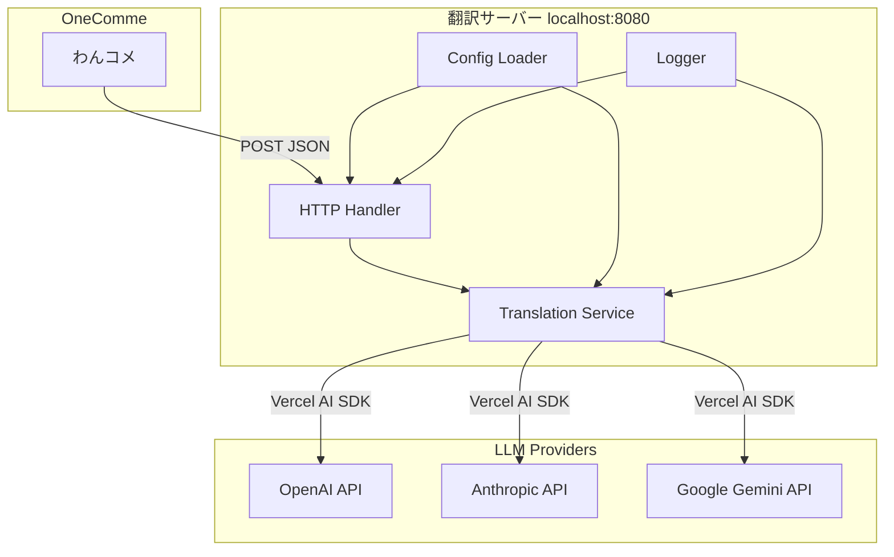
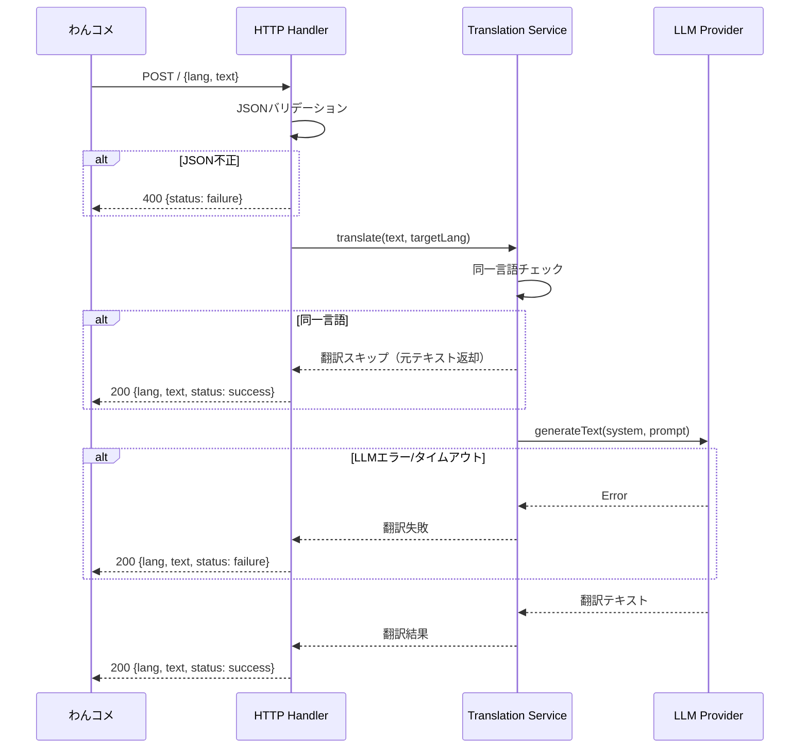

# Design Document: llm-translate-server

## Overview

**Purpose**: わんコメのコメント翻訳連携で使用するTrans-through互換の軽量翻訳サーバーを提供する。LLM API（OpenAI, Anthropic, Google Gemini）を翻訳エンジンとして使用し、配信コメントに特化した高品質な翻訳を実現する。

**Users**: 配信者がわんコメと組み合わせて使用する。既存のTrans-through連携設定をそのまま利用可能。

**Impact**: ゆかりねっとコネクターNEO/Trans-throughの代替として、LLMベースの翻訳を最小構成で提供する。

### Goals
- Trans-throughと完全互換のHTTP APIを提供する
- OpenAI・Anthropic・Google Geminiの3プロバイダーをサポートする
- 起動時メモリ100MB以下の軽量サーバーを実現する
- YAML設定ファイルで簡単にカスタマイズ可能にする

### Non-Goals
- WebSocket出力（ゆかりねっとコネクターNEO互換）
- 音声読み上げ（TTS）機能
- GUIやWeb管理画面
- 複数エンドポイントやREST API設計
- レート制限やキャッシュ機構（初期スコープ外）

## Architecture

### Architecture Pattern & Boundary Map

シンプルレイヤードアーキテクチャを採用。Vercel AI SDKがプロバイダー抽象を担うため、追加のアダプター層は不要。



**Architecture Integration**:
- 選定パターン: シンプルレイヤード — 単一エンドポイントサーバーに最適、過剰な抽象化を回避
- ドメイン境界: HTTP処理（Handler）と翻訳ロジック（Translation Service）を分離
- 新コンポーネント: 全て新規（グリーンフィールド）
- Vercel AI SDKが全プロバイダーへの統一インターフェースを提供

### Technology Stack

| Layer | Choice / Version | Role in Feature | Notes |
|-------|------------------|-----------------|-------|
| Runtime | Node.js 20 LTS + TypeScript 5.x | アプリケーション実行環境 | ESM |
| HTTP Server | Hono 4.x + @hono/node-server | HTTPリクエスト処理 | ゼロ依存コア |
| LLM SDK | ai 6.x (Vercel AI SDK) | 統一LLMインターフェース | |
| LLM Provider | @ai-sdk/openai, @ai-sdk/anthropic, @ai-sdk/google | プロバイダー接続 | |
| Config | js-yaml 4.x + dotenv 16.x | 設定ファイル解析・環境変数 | |
| Build | tsup | TypeScriptバンドル | 軽量ビルドツール |

## System Flows

### 翻訳リクエスト処理フロー



## Requirements Traceability

| Requirement | Summary | Components | Interfaces | Flows |
|-------------|---------|------------|------------|-------|
| 1.1 | POST / でJSON受付 | HttpHandler | API Contract | 翻訳リクエスト |
| 1.2 | 成功レスポンス形式 | HttpHandler | API Contract | 翻訳リクエスト |
| 1.3 | 失敗レスポンス形式 | HttpHandler | API Contract | 翻訳リクエスト |
| 1.4 | デフォルトポート8080 | ConfigLoader | — | — |
| 1.5 | ポート番号設定可能 | ConfigLoader | Config型 | — |
| 2.1 | 3プロバイダーサポート | TranslationService | Service Interface | 翻訳リクエスト |
| 2.2 | プロバイダー/モデル/キー設定 | ConfigLoader | Config型 | — |
| 2.3 | システムプロンプトカスタマイズ | ConfigLoader, TranslationService | Config型 | — |
| 2.4 | 翻訳先言語指示 | TranslationService | Service Interface | 翻訳リクエスト |
| 2.5 | 翻訳テキストのみ抽出 | TranslationService | — | 翻訳リクエスト |
| 3.1 | 同一言語スキップ | TranslationService | — | 翻訳リクエスト |
| 3.2 | ソース言語自動検出 | TranslationService | — | 翻訳リクエスト |
| 4.1 | メモリ100MB以下 | 全体 | — | — |
| 4.2 | 並行処理 | HttpHandler | — | — |
| 4.3 | ノンブロッキング | HttpHandler, TranslationService | — | — |
| 5.1 | タイムアウト時failure返却 | TranslationService, HttpHandler | API Contract | 翻訳リクエスト |
| 5.2 | APIエラーログ+failure | TranslationService, Logger | — | 翻訳リクエスト |
| 5.3 | 不正JSON時400+failure | HttpHandler | API Contract | 翻訳リクエスト |
| 5.4 | タイムアウト設定可能 | ConfigLoader | Config型 | — |
| 6.1 | 設定ファイル読み込み | ConfigLoader | Config型 | — |
| 6.2 | 環境変数APIキー | ConfigLoader | — | — |
| 6.3 | 設定ファイルなしでデフォルト起動 | ConfigLoader | — | — |
| 7.1 | 起動時ログ | Logger, HttpHandler | — | — |
| 7.2 | リクエスト結果ログ | Logger, HttpHandler | — | — |
| 7.3 | ログレベル設定 | Logger, ConfigLoader | Config型 | — |

## Components and Interfaces

| Component | Domain/Layer | Intent | Req Coverage | Key Dependencies | Contracts |
|-----------|--------------|--------|--------------|------------------|-----------|
| HttpHandler | HTTP | Trans-through互換エンドポイント | 1.1-1.5, 4.2-4.3, 5.3 | TranslationService (P0), ConfigLoader (P0) | API |
| TranslationService | Business | LLMによる翻訳実行 | 2.1-2.5, 3.1-3.2, 5.1-5.2 | Vercel AI SDK (P0), ConfigLoader (P0) | Service |
| ConfigLoader | Infrastructure | 設定ファイル・環境変数の読み込み | 1.4-1.5, 2.2-2.3, 5.4, 6.1-6.3, 7.3 | js-yaml (P1), dotenv (P1) | State |
| Logger | Infrastructure | 構造化ログ出力 | 7.1-7.3 | — | — |

### HTTP Layer

#### HttpHandler

| Field | Detail |
|-------|--------|
| Intent | Trans-through互換のPOST / エンドポイントを提供し、リクエスト/レスポンスの変換を行う |
| Requirements | 1.1, 1.2, 1.3, 1.4, 1.5, 4.2, 4.3, 5.3 |

**Responsibilities & Constraints**
- `POST /` でJSONリクエストを受信し、バリデーション後にTranslationServiceへ委譲
- TranslationServiceの結果をTrans-through形式のJSONレスポンスに変換
- 非同期処理によりリクエスト間のブロッキングを防止

**Dependencies**
- Outbound: TranslationService — 翻訳実行 (P0)
- Outbound: ConfigLoader — ポート番号取得 (P0)
- Outbound: Logger — リクエストログ (P1)
- External: Hono — HTTPフレームワーク (P0)

**Contracts**: API [x]

##### API Contract

| Method | Endpoint | Request | Response | Errors |
|--------|----------|---------|----------|--------|
| POST | / | TranslateRequest | TranslateResponse | 400 (不正JSON) |

```typescript
interface TranslateRequest {
  lang: string;   // 翻訳先言語コード (例: "ja", "en", "ja_JP", "en_US")
  text: string;   // 翻訳対象テキスト
}

interface TranslateResponse {
  lang: string;   // 成功時: 翻訳先言語コード / 失敗時: 元の言語コード
  text: string;   // 成功時: 翻訳結果 / 失敗時: 元のテキスト
  status: 'success' | 'failure';
}
```

- Preconditions: Content-Type: application/json
- Postconditions: 常にHTTP 200でTranslateResponse形式を返却（不正JSONのみ400）
- Invariants: `status` フィールドは必ず `"success"` または `"failure"`

### Business Layer

#### TranslationService

| Field | Detail |
|-------|--------|
| Intent | LLM APIを使用したテキスト翻訳の実行と言語検出 |
| Requirements | 2.1, 2.2, 2.3, 2.4, 2.5, 3.1, 3.2, 5.1, 5.2 |

**Responsibilities & Constraints**
- Vercel AI SDK `generateText()` を使用して翻訳を実行
- 翻訳先言語と同一言語のテキストはスキップ（LLMに言語判定を委任）
- LLMレスポンスから翻訳テキストのみを抽出
- タイムアウト・エラー発生時は例外をスローせず、結果型で通知

**Dependencies**
- Outbound: ConfigLoader — プロバイダー/モデル/プロンプト/タイムアウト設定 (P0)
- Outbound: Logger — 翻訳結果・エラーログ (P1)
- External: Vercel AI SDK (`ai`) — LLM統一インターフェース (P0)
- External: @ai-sdk/openai, @ai-sdk/anthropic, @ai-sdk/google — プロバイダー接続 (P0)

**Contracts**: Service [x]

##### Service Interface

```typescript
interface TranslationResult {
  translatedText: string;
  targetLang: string;
  skipped: boolean;  // 同一言語でスキップした場合true
}

interface TranslationError {
  code: 'TIMEOUT' | 'API_ERROR' | 'UNKNOWN';
  message: string;
}

type TranslateResult =
  | { ok: true; value: TranslationResult }
  | { ok: false; error: TranslationError };

interface TranslationService {
  translate(text: string, targetLang: string): Promise<TranslateResult>;
}
```

- Preconditions: `text` が空文字でないこと、`targetLang` が有効な言語コードであること
- Postconditions: 必ず `TranslateResult` を返却（例外をスローしない）
- Invariants: LLM APIの障害がサーバー全体に波及しない

**Implementation Notes**
- システムプロンプトにて翻訳テキストのみの出力を指示し、`temperature: 0` で決定的な翻訳を得る
- `maxTokens` を入力テキスト長に応じて適切に制限し、冗長な出力を防止
- 言語コードマッピング（`ja` → `Japanese`, `ja_JP` → `Japanese`）でLLMへの指示を自然言語化

### Infrastructure Layer

#### ConfigLoader

| Field | Detail |
|-------|--------|
| Intent | YAML設定ファイルと環境変数からアプリケーション設定を読み込む |
| Requirements | 1.4, 1.5, 2.2, 2.3, 5.4, 6.1, 6.2, 6.3, 7.3 |

**Responsibilities & Constraints**
- 設定優先順位: デフォルト値 < config.yaml < 環境変数
- APIキーは環境変数からのみ取得（設定ファイルに記述不可）
- 設定ファイルが存在しない場合はデフォルト値で起動

**Dependencies**
- External: js-yaml — YAML解析 (P1)
- External: dotenv — .envファイル読み込み (P1)

**Contracts**: State [x]

##### State Management

```typescript
interface AppConfig {
  port: number;                    // デフォルト: 8080
  provider: 'openai' | 'anthropic' | 'google';  // デフォルト: 'openai'
  model: string;                   // デフォルト: プロバイダー依存
  apiKey: string;                  // 環境変数から必須
  timeout: number;                 // デフォルト: 30000 (ms)
  systemPrompt: string;            // デフォルト: 内蔵プロンプト
  logLevel: 'debug' | 'info' | 'warn' | 'error';  // デフォルト: 'info'
}
```

- デフォルトモデル: OpenAI → `gpt-4.1-nano`, Anthropic → `claude-haiku-4-5`, Google → `gemini-2.5-flash-lite`
- 環境変数マッピング: `PORT`, `LLM_PROVIDER`, `LLM_MODEL`, `LLM_API_KEY`, `LLM_TIMEOUT`, `LOG_LEVEL`
- `LLM_API_KEY` はプロバイダー共通。プロバイダー別の `OPENAI_API_KEY` / `ANTHROPIC_API_KEY` / `GOOGLE_API_KEY` も代替としてサポート

#### Logger

| Field | Detail |
|-------|--------|
| Intent | ログレベル付きの構造化コンソールログ出力 |
| Requirements | 7.1, 7.2, 7.3 |

**Responsibilities & Constraints**
- console.log/warn/errorベースのシンプルなロガー（外部ライブラリ不要）
- ログレベルによるフィルタリング
- タイムスタンプ付き出力

**Implementation Notes**
- 外部ロガーライブラリは使用しない（軽量性のため）
- `[INFO] 2026-03-21T12:00:00Z - Translation success: en -> ja` 形式

## Data Models

### Data Contracts & Integration

**API Data Transfer**

リクエスト/レスポンスのJSON構造は `TranslateRequest` / `TranslateResponse` インターフェースで定義済み（HttpHandler API Contract参照）。

**言語コードマッピング**

```typescript
type LangCode = string;  // "ja", "en", "ko", "zh", "ja_JP", "en_US" 等

const LANG_NAME_MAP: Record<string, string> = {
  ja: 'Japanese', en: 'English', ko: 'Korean',
  zh: 'Chinese', es: 'Spanish', fr: 'French',
  de: 'German', pt: 'Portuguese', ru: 'Russian',
  th: 'Thai', vi: 'Vietnamese', id: 'Indonesian',
  ar: 'Arabic', it: 'Italian',
  // ロケール形式のエイリアス
  ja_JP: 'Japanese', en_US: 'English', ko_KR: 'Korean',
  zh_CN: 'Simplified Chinese', zh_TW: 'Traditional Chinese',
};
```

解決できない言語コードはそのままLLMに渡す（LLMが解釈を試みる）。

## Error Handling

### Error Strategy
全てのエラーをTranslateResponseの `status: "failure"` に変換し、サーバーは常に稼働を継続する。HTTPステータスコードは原則200（クライアント互換のため）、不正JSONのみ400。

### Error Categories and Responses

| Category | Trigger | Response | Log Level |
|----------|---------|----------|-----------|
| 不正JSON | パース失敗 | HTTP 400, `{status: "failure"}` | warn |
| LLMタイムアウト | AbortSignal発火 | HTTP 200, `{status: "failure", text: 元テキスト}` | error |
| LLM APIエラー | 4xx/5xx | HTTP 200, `{status: "failure", text: 元テキスト}` | error |
| 不明なエラー | 予期しない例外 | HTTP 200, `{status: "failure", text: 元テキスト}` | error |

### Monitoring
- 起動時: リッスンポート、プロバイダー名、モデル名をINFOログ出力
- リクエスト毎: 成功/失敗、翻訳方向（例: `en -> ja`）、所要時間をINFOログ出力
- エラー時: エラー詳細（タイムアウト/APIエラーコード/メッセージ）をERRORログ出力

## Testing Strategy

### Unit Tests
- ConfigLoader: デフォルト値、YAMLファイル読み込み、環境変数オーバーライド、ファイル不在時のフォールバック
- TranslationService: 同一言語スキップ判定、LLMレスポンス抽出、エラーハンドリング（タイムアウト、APIエラー）
- Logger: ログレベルフィルタリング

### Integration Tests
- エンドツーエンド翻訳フロー（モックLLM使用）: 正常系・異常系
- Trans-through互換性: リクエスト/レスポンス形式の検証
- 設定ファイル統合: YAML + 環境変数の組み合わせ

### E2E Tests
- わんコメとの実機連携テスト（手動）
- 各LLMプロバイダーでの翻訳品質確認（手動）
